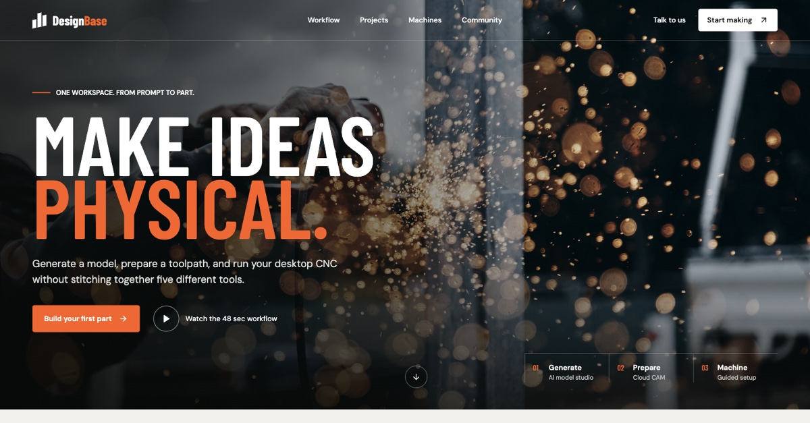
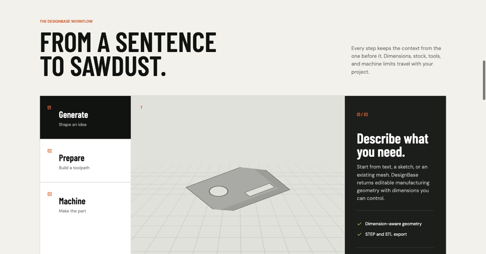

<h1 align="center">DESIGN BASE</h1>

<p align="center">
  <strong>THE DESIGN INFRASTRUCTURE LAYER FOR AI CODING AGENTS.</strong>
</p>

<p align="center">
  <a href="https://github.com/DeerManSayNo/design-base-skill/stargazers"></a>
  <a href="https://github.com/DeerManSayNo/design-base-skill/releases/latest"></a>
  <a href="https://github.com/DeerManSayNo/design-base-skill/releases"></a>
  
</p>

<p align="center">
  <strong>让 AI 不只生成页面，更能继承规则、维护一致性、验证结果。</strong><br />
  为 AI 编码项目建立一套可持续演进的设计基础设施。<br />
  纯 Markdown、单入口、零运行时依赖，可无缝接入主流 Code Agent 与通用 Agent。
</p>

<p align="center">
  <a href="https://www.pexels.com/photo/apple-monitors-326518/">
    
  </a>
</p>

---

AI 已经能在几秒钟内生成一个页面。真正昂贵的问题随之出现：**每次新会话都可能重置设计上下文，每次新需求都可能引入一套新的视觉逻辑。**

颜色在漂移，间距在分叉，组件在重复，局部修复不断侵蚀整体一致性。页面越来越多，设计秩序却没有随项目一起成长。

**Design Base** 为编码代理补上这一层缺失的基础设施。它把设计依据、Token、组件契约、共享规则和验证流程组织成可读取、可执行、可治理的项目资产，让 AI 从“完成这张页面”走向“维护这个产品的设计系统”。

> **代码有工程基础设施，AI 生成的界面也应该有设计基础设施。**

<p align="center">
  <strong>如果你也在解决 AI 界面的一致性与可维护性，Star 这个项目，让这套基础继续生长。</strong>
</p>

## Works With Your Agent

Design Base 采用纯 Markdown 和单入口结构，可以进入你已经在使用的 Agent 工作流：

<p align="center">
  
  
  
  
  
  
</p>
<p align="center">
  
  
  
  
  
  
</p>

- **OpenAI Codex**、**Claude Code**、**Cursor**：作为 Skill 或项目级指令入口加载。
- **GitHub Copilot**、**Gemini CLI**、**Windsurf**：接入各自的 Custom Instructions、Rules 或项目上下文。
- **Cline**、**Roo Code**、**Kiro**：通过 Rules、Steering 或等价的项目指令机制接入。
- **Trae**、**Qoder**、**OpenCode**：作为项目规则、Skill 或 `AGENTS.md` 指向的设计入口使用。
- **其他 Agent**：只要能够读取 Markdown Skill、Rules 或指令文件，就可以加载同一套设计基础设施。

无需安装插件，无需启动服务，无需增加运行时依赖。不同 Agent 只负责找到 `SKILL.md`，内部模块、参考资料和模板继续按任务需要加载。

## The Missing Layer

一次性 Prompt 可以影响一次输出，设计基础设施负责守住整个项目。

| 只有页面提示词 | 接入 Design Base |
| --- | --- |
| 每次任务重新解释风格 | 代理读取项目已有设计依据 |
| 组件由当前页面临时决定 | Token 与组件契约持续约束实现 |
| 局部改动悄悄改变全局 | 共享规则有明确准入和作用范围 |
| “看起来不错”就结束 | 关键状态、响应式与真实渲染必须验证 |
| 上下文越堆越长 | 模块和参考资料按任务需要加载 |
| AI 默认审美不断回归 | 产品语义与品牌依据持续参与决策 |

Design Base 的价值不会停留在第一张页面。项目越长、参与的 Agent 越多、界面变化越频繁，这层基础设施越能减少设计决策丢失和无意识分叉。

## Four Infrastructure Layers

| 基础设施层 | 核心资产 | 解决的问题 |
| --- | --- | --- |
| **Design Memory** | 设计依据、品牌方向、项目入口 | 新会话如何继承已经确认的设计决定 |
| **Rule Governance** | Token、组件契约、共享规则 | 局部决定如何进入系统，同时不污染全局 |
| **Interface Execution** | 页面结构、组件、样式、交互 | 设计意图如何稳定落实为真实代码 |
| **Quality Verification** | 状态、响应式、运行截图、审查依据 | 实现结果如何被检查、修正和追踪 |

这四层由三个执行模块持续驱动：

| 阶段 | 模块 | 职责 |
| --- | --- | --- |
| **01 · FOUNDATION** | `modules/foundation` | 建立和治理设计记忆、Token 契约与项目规则 |
| **02 · COMPOSE** | `modules/compose` | 把产品任务和设计规则落实为界面与交互 |
| **03 · VERIFY** | `modules/verify` | 验证实现质量、关键状态、响应式和设计一致性 |

```text
PRODUCT INTENT
      ↓
DESIGN MEMORY  ←──────────────┐
      ↓                       │
FOUNDATION → COMPOSE → VERIFY │
      ↓          ↓         ↓  │
   RULES      INTERFACE   EVIDENCE
      └──────────┴─────────┘
             EVOLVE
```

<p align="center">
  <a href="https://www.pexels.com/photo/white-printer-paper-196645/">
    
  </a>
  <a href="https://www.pexels.com/photo/a-person-holding-black-smartphone-11780441/">
    
  </a>
</p>
<p align="center"><sub>从设计推导、规则沉淀，到真实设备和关键状态验证。</sub></p>

代理只需注册 `SKILL.md`。Design Base 会根据任务范围调用对应模块，并在确有需要时读取设计推导、架构、规范、审查依据或项目模板。

## Why It Stays Useful

Design Base 不是安装后只触发一次的脚手架。它覆盖界面生命周期中反复发生的工作：

- **新项目启动**：建立最小但完整的设计依据、Token 契约和规则索引。
- **新页面进入系统**：沿用有效决定，在信息关系缺失时完成必要推导。
- **组件持续演进**：区分局部例外、候选规则和可进入全局的共享默认。
- **多人或多 Agent 协作**：让设计决定留在项目里，减少对单次对话上下文的依赖。
- **设计债务治理**：定位历史偏差、规则冲突和缺失状态，控制每次修改的影响范围。
- **交付前验证**：检查真实渲染、交互反馈、响应式表现和关键状态。

每一次有效设计决定都可以成为下一次任务的起点。Design Base 的长期价值来自这种累积，而非更长的 Prompt。

## Infrastructure Coverage

- 项目设计依据与品牌方向
- Design Token 与主题契约
- 组件规则、状态和 API 边界
- 页面结构、布局与响应式策略
- 导航、表单、反馈和覆盖层行为
- 动效、可访问性与内容规则
- 共享设计规则准入与迁移
- AI 模板感和通用生成痕迹审查
- 运行截图、关键状态与实现验证

## Built Against "AI Look"

Design Base 不依赖简单的风格黑名单。紫色、渐变、卡片、圆角和大标题都可以成立，前提是它们来自产品语义、内容关系或品牌表达。

它要求代理持续回答：

- 视觉方向是否属于这个产品
- 信息层级是否支持真实任务
- 组件选择是否匹配使用频率与内容密度
- 设计决定是否已有依据和明确范围
- 装饰是否承担功能、品牌或叙事作用
- 页面在真实尺寸和关键状态下是否仍然成立

目标很直接：**让 AI 构建的界面拥有产品自己的设计语言，并且经得起下一次迭代。**

## Install

从 [Latest Release](https://github.com/DeerManSayNo/design-base-skill/releases/latest) 下载 `design-system-v1.0.1.zip`，解压到编码代理的 Skills 目录：

```text
design-system/
├── SKILL.md
├── VERSION
├── agents/
├── modules/
├── references/
└── templates/
```

安装后注册 `design-system/SKILL.md`。内部模块无需单独注册，代理会按任务读取。

## Inside The Infrastructure

```text
design-system/
├── SKILL.md                         # 设计基础设施入口
├── VERSION                          # 当前语义化版本
├── agents/
│   └── openai.yaml                  # Agent 展示元数据
├── modules/
│   ├── foundation/instructions.md   # 设计记忆与规则治理
│   ├── compose/instructions.md      # 页面和组件实施
│   └── verify/instructions.md       # 运行与设计验证
├── references/
│   ├── design-reasoning.md          # 从任务推导设计方向
│   ├── anti-ai-aesthetic.md         # AI 平均化与模板感审查
│   ├── design-spec.md               # 视觉和交互规则参考
│   ├── architecture.md              # 设计资产架构
│   └── shared-rule-review.md        # 共享规则准入检查
└── templates/                       # 项目设计基础设施模板
```

## Principles

1. **任务先于版式**：先确定用户要完成什么，再决定页面如何表达。
2. **依据先于偏好**：品牌、内容、场景和既有系统共同决定视觉方向。
3. **规则必须有边界**：局部决定不会自动升级为全局规范。
4. **实现必须可验证**：截图、交互、状态和响应式都属于设计结果。
5. **系统必须可演进**：新决定明确适用范围，旧规则与例外保持可追踪。
6. **上下文保持克制**：资料足以支持决定时停止扩展读取。

## Versioning

项目遵循[语义化版本](https://semver.org/lang/zh-CN/)。当前版本记录在 [`VERSION`](VERSION)，完整变化见 [`CHANGELOG.md`](CHANGELOG.md)，Git 标签与 GitHub Release 使用 `v<版本号>` 格式。

<sub>Images used under the [Pexels License](https://www.pexels.com/license/): [Tranmautritam](https://www.pexels.com/@tranmautritam/), [picjumbo.com](https://www.pexels.com/@picjumbo-com-55570/), and [Akshar Dave](https://www.pexels.com/@akshar-dave/).</sub>

---

<p align="center">
  <strong>BUILD THE DESIGN BASE ONCE. LET EVERY INTERFACE INHERIT IT.</strong><br /><br />
  如果这正是你的 AI 项目缺少的一层，请给仓库一个 Star。<br />
  它会帮助更多开发者找到一条从“生成页面”走向“建设设计系统”的路径。
</p>
